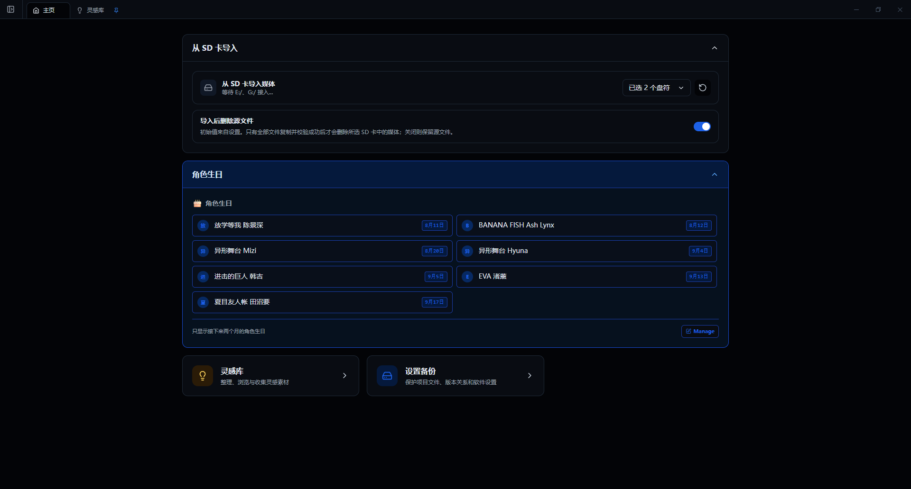

# 照片流 PhotoFlow 产品介绍

照片流是一款面向摄影师和小型摄影团队的 Windows 本地桌面软件。它把拍摄项目、SD 卡导入、素材浏览、选片、后期版本、灵感整理、备份和归档放进同一个工作区，减少重复的文件操作以及由人工移动、重命名和漏拷贝造成的错误。

## 适合哪些工作

- 按“策划中、待拍摄、后期中、已归档”推进摄影项目，也可以添加自定义分类。
- 从一张或多张 SD 卡导入素材，并自动整理 RAW、JPG、视频和花絮。
- 在网格或列表中浏览图片、RAW、视频及普通文件，查看预览和技术信息。
- 根据客户给出的文件名批量选片，或把当前选中的媒体加入选片结果。
- 建立多轮后期进度，跟踪版本关系、当前版本、备注和喜爱状态。
- 使用灵感库收集参考图，并把灵感素材增加到目标项目的“策划”文件夹。
- 使用 PNG 转 JPG、截图主图提取、视频分镜、视频转码、视频切割和 Office 图片提取等工具。
- 安装可选组件后使用团片协作和高级视频解码。
- 使用本地盘或 NAS 创建历史备份，并把完成项目归档到其他磁盘。

## 核心特点

### 本地优先

项目素材和核心项目数据在本机处理。照片流不会因为正常使用而自动把客户原片上传到网络。

### 普通文件夹结构

照片流管理的项目仍是普通 Windows 文件夹，可以继续用资源管理器、Photoshop 或其他软件访问。软件的数据库、缩略图和缓存不会写入客户项目目录。

### 文件操作保护

复制和跨盘移动先写入临时文件并完成校验，再发布为最终文件；删除优先进入系统回收站。部分操作支持取消和恢复，但这些保护不能代替独立备份。

### 可扩展组件

主程序提供项目和媒体工作流；人物检测、团片裁切合回以及高级相机视频播放通过独立组件安装，便于按需使用和更新。

## 当前平台与使用提醒

- 当前主要发布和验证平台为 Windows 10/11 x64。
- 软件仍在持续开发，首次使用前应备份重要数据，并先用素材副本验证工作流。
- 导入设置可能删除或移动源文件。第一次使用时建议关闭“导入后默认删除源文件”。

