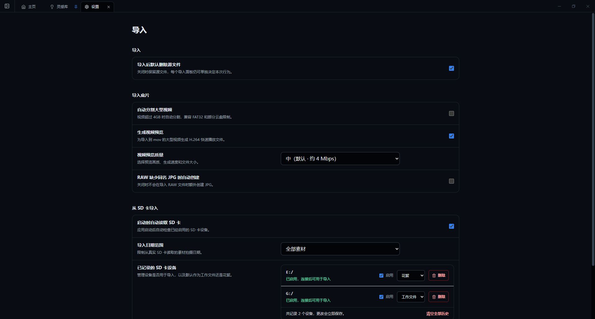

# 安装与首次启动

## 系统要求

- Windows 10 或 Windows 11，x64 架构。
- 建议为缩略图、视频预览和备份预留充足磁盘空间。
- 若需要团片协作或高级视频解码，应另行准备对应的组件 ZIP。

## 安装主程序

1. 下载最新的 `照片流 Setup <版本>.exe`。
2. 运行安装程序，阅读并接受安装条款。
3. 选择安装目录并完成安装。
4. 启动“照片流”。

## 选择工作文件夹

第一次启动时需要选择工作文件夹。该位置用于存放摄影项目。

- 如果选择某个普通文件夹，照片流直接把它作为工作目录。
- 如果选择磁盘根目录，照片流会在该磁盘下创建“照片流”文件夹。
- 如果已有 PhotoFlow 完整备份，可以在首次启动页选择“从备份恢复”，再选择目标工作文件夹和快照。

建议为正式项目选择容量充足、连接稳定的本地磁盘。网络盘和可移动磁盘断连时，文件操作可能失败。

## 第一次使用前必须检查

打开“设置 → 导入”，确认以下项目：

1. **导入后默认删除源文件**：首次使用建议关闭。关闭后保留 SD 卡或来源文件夹中的原文件。
2. **自动分割大型视频**：需要兼容 FAT32 或单文件大小限制时开启。
3. **生成视频预览**：大型视频较多时开启，可改善软件内预览体验。
4. **视频预览质量**：中等质量生成较快、占用较小；高质量更清晰但更耗时。
5. **RAW 缺少同名 JPG 时自动创建**：需要快速浏览配套 JPG 时开启。

再打开“设置 → 存储”，检查缩略图缓存、备份位置和归档位置。

## 安装可选组件

1. 下载与当前主程序版本及平台匹配的组件 ZIP。
2. 打开“设置 → 组件管理”。
3. 在对应组件行点击“安装”，选择 ZIP 文件。
4. 安装完成后点击“刷新”，确认状态已变为可用。

不要手工把 ZIP 解压到照片流安装目录。组件由软件统一保存和管理。
