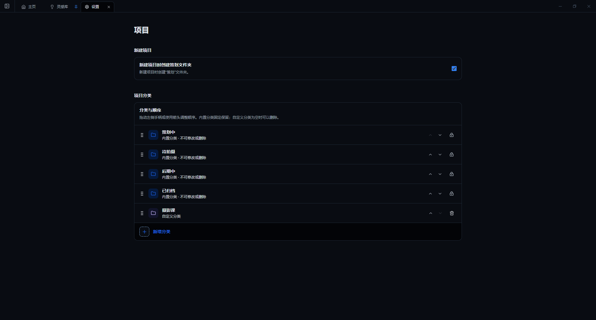

# 首页与项目管理

## 认识首页

首页由项目栏、功能标签和信息卡片组成：

- 左侧项目栏按分类显示项目，并提供“新建项目”和设置入口。
- 顶部标签可以同时打开主页、灵感库、多个项目以及版本管理或团片协作页面。
- 首页卡片提供 SD 卡导入、角色生日、灵感库和备份状态。
- 项目栏可以折叠，为素材浏览和工具面板留出更多空间。

## 新建项目

1. 点击左侧“新建项目”。
2. 输入日期、项目名称或两者。
3. 确认后，项目默认进入“策划中”。
4. 如果设置中开启“新建项目时创建策划文件夹”，项目内会自动生成“策划”目录。

项目名称会对应实际文件夹名称。建议使用统一格式，例如“26-08-09 客户或主题”。避免使用 Windows 文件名不支持的字符。

## 项目分类

内置分类包括：

- 策划中
- 待拍摄
- 后期中
- 已归档

可在“设置 → 项目”中新增自定义分类，并拖动或使用箭头调整顺序。内置分类不能删除。

## 项目常用操作

在项目菜单中可以完成：

- 打开项目或直接打开项目文件夹。
- 修改项目分类。
- 从 SD 卡导入、导入底片、导入进度或导入花絮。
- 从文件名选片。
- 重命名项目。
- 将项目移入系统回收站。
- 对已完成项目执行归档。

## 多标签工作

打开项目后会生成标签页。进入子文件夹时，标签标题会显示项目和当前文件夹。关闭项目标签不会删除项目或文件。

版本比较、确认和团片任务可以在后台继续运行。关闭对应工具标签前，软件会提示任务是否仍在执行。
