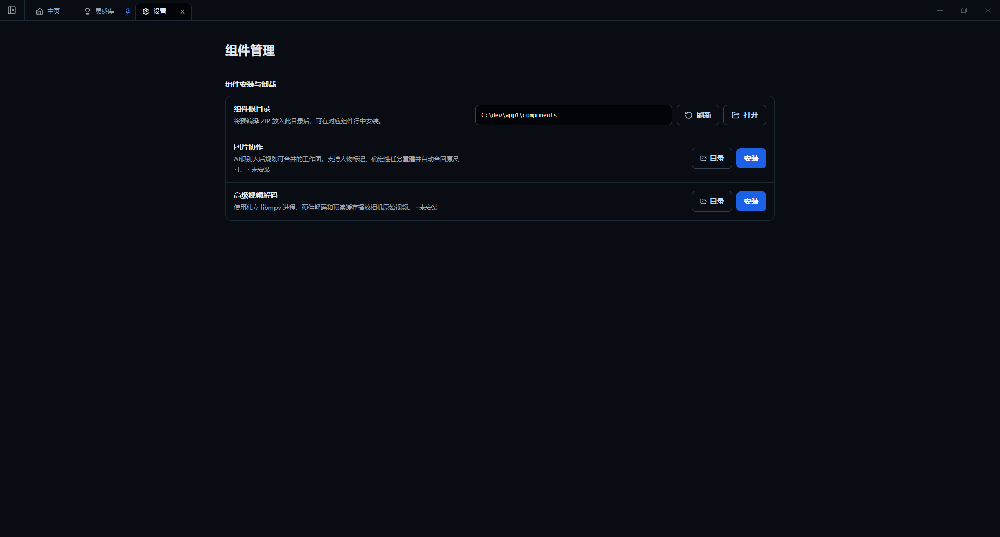

# 团片协作与可选组件

## 组件管理

当前主要可选组件包括：

- **团片协作**：AI 识别人后规划可合并的工作图，支持人物标记、任务重建和合回原尺寸。
- **高级视频解码**：使用独立 libmpv 进程、硬件解码和预读缓存播放相机原始视频。

在“设置 → 组件管理”中安装、刷新或打开组件目录。组件未安装时，对应功能会显示为不可用并说明原因。

## 团片协作流程

1. 在项目中选择一张或多张高分辨率合照。
2. 点击“团片协作”，打开独立工作区。
3. 使用 AI 检测人物，检查人物框和裁切范围。
4. 为人物填写名称和接收人，必要时调整裁切。
5. 导出适合手机或外部修图软件处理的小图。
6. 收回修好的图片并批量导入。
7. 检查人物匹配、对齐、颜色和重叠区域。
8. 合回原始尺寸，并检查最终输出。

团片协作的价值在于：协作者只处理较小的个人区域，最终结果重新合回原分辨率，减少多次社交软件传输和手机导出造成的整张照片画质损失。

## 安全提示

- 自动检测可能漏人、重复识别或裁切不完整，导出前必须逐人检查。
- 不要覆盖唯一原片；在副本上完成首次工作流验证。
- 收回图片时保持任务标识和文件名，避免人物错配。
- 合回后放大检查边缘、发丝、透明物、遮挡关系和肤色一致性。
- 关闭团片标签不会取消后台任务；重新打开后可以继续查看进度。

## 高级视频解码

安装后，可使用独立播放进程处理部分相机原始视频，并利用硬件解码和缓存改善播放。若遇到黑屏、花屏或不同步，可先切回基础播放方式，并记录相机型号、编码、分辨率和帧率后反馈。
