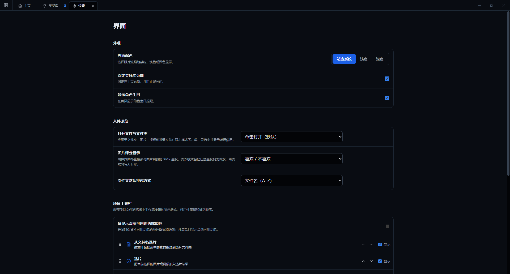

# 设置、常见问题与反馈

## 设置页面导航

- **界面**：配色、灵感库固定、生日提醒、单击/双击打开、星级显示、默认排序和项目工具栏。
- **项目**：新建项目的默认文件夹、自定义项目分类及顺序。
- **导入**：源文件处理、视频分割与预览、RAW 配套 JPG、SD 卡设备和日期范围。
- **存储**：工作区用量、缓存、备份和归档。
- **组件管理**：安装或更新团片协作和高级视频解码。
- **组件**：已安装组件的运行选项。
- **关于**：版本、更新、项目主页、联系方式、模型和第三方许可证。
- **问题和建议**：提交反馈。
- **隐私与数据**：遥测、崩溃报告和本地数据管理。

## 常见问题

### 为什么项目没有出现？

确认当前工作文件夹是否正确、项目是否位于工作目录内，并检查项目分类是否折叠。不要直接修改应用数据库。

### 导入后 SD 卡文件不见了？

检查“导入后默认删除源文件”和本次导入面板中的开关。开启时，校验成功后软件会处理来源媒体。请检查项目目标目录和系统回收站，并立即停止对 SD 卡写入。

### 视频无法预览？

尝试生成 H.264 视频预览；如已安装高级视频解码，切换解码方式。反馈时提供编码、分辨率、帧率、相机型号和错误提示，不要上传客户原片。

### 团片协作按钮是灰色的？

确认组件已安装并刷新状态，同时在项目中选择支持的图片。组件版本需要与主程序和 Windows x64 平台匹配。

### 版本显示“待刷新”或“需要修复”？

“待刷新”说明文件变化影响了已确认关系，应重新比较；“需要修复”说明之前的提交不完整，进入修复面板继续处理，不要直接删除数据库记录。

### 备份盘未连接怎么办？

重新连接本地盘或 NAS，确认盘符、网络路径和凭据没有变化，再刷新状态。不要在目标不可用时反复创建新的备份位置。

### 删除文件能否恢复？

优先检查系统回收站。照片流数据库不保存完整媒体副本，因此回收站已清空时需要从独立备份恢复。

## 反馈问题

反馈时请提供：

- Windows 版本和照片流版本。
- 问题发生前的操作步骤。
- 实际结果和预期结果。
- 错误提示或经过隐私检查的截图。
- 媒体类型、编码、尺寸等必要技术信息。

请勿上传包含客户隐私的原片。提交日志前应移除个人路径、客户姓名和文件名。联系邮箱：`akiyastudio@qq.com`。
